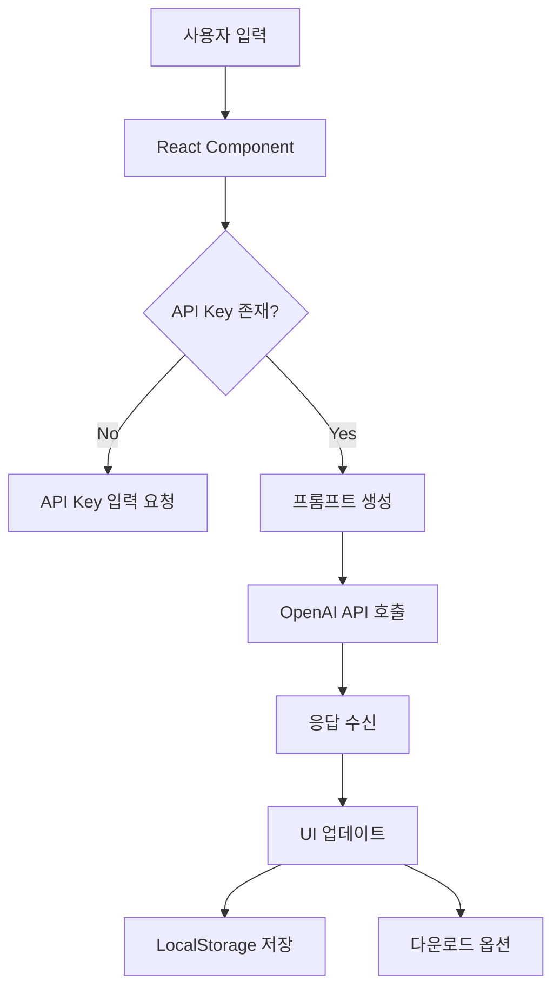

# 간소화된 아키텍처 설계

## 시스템 구조도

```
┌────────────────────────────────────────────┐
│           사용자 브라우저                    │
├────────────────────────────────────────────┤
│                                            │
│  ┌──────────────────────────────────┐     │
│  │     React SPA (Single Page)      │     │
│  │  ├─ Dashboard                    │     │
│  │  ├─ Syllabus Generator           │     │
│  │  ├─ Rubric Builder               │     │
│  │  ├─ Assignment Creator           │     │
│  │  └─ Chat Interface               │     │
│  └──────────────────────────────────┘     │
│                    ↓                       │
│  ┌──────────────────────────────────┐     │
│  │      Service Layer               │     │
│  │  ├─ OpenAI Service               │     │
│  │  ├─ Storage Service              │     │
│  │  └─ Export Service               │     │
│  └──────────────────────────────────┘     │
│                    ↓                       │
│  ┌──────────────────────────────────┐     │
│  │       Local Storage              │     │
│  │  ├─ API Key (encrypted)          │     │
│  │  ├─ Chat History                 │     │
│  │  └─ Saved Templates              │     │
│  └──────────────────────────────────┘     │
└────────────────────────────────────────────┘
                    ↓
        ┌──────────────────────┐
        │    OpenAI API         │
        │  (External Service)   │
        └──────────────────────┘
```

## 데이터 플로우



## 컴포넌트 계층 구조

```
App.tsx
├── Layout
│   ├── Header
│   │   ├── Logo
│   │   ├── Navigation
│   │   └── Settings (API Key)
│   ├── Sidebar
│   │   ├── MenuItems
│   │   └── RecentHistory
│   └── Footer
├── Routes
│   ├── Dashboard
│   │   ├── QuickActions
│   │   ├── Statistics
│   │   └── RecentWork
│   ├── SyllabusPage
│   │   ├── CourseInfoForm
│   │   ├── CLOBuilder
│   │   ├── WeeklyPlan
│   │   └── ExportOptions
│   ├── RubricPage
│   │   ├── AssignmentInput
│   │   ├── CriteriaBuilder
│   │   ├── ScoreDistribution
│   │   └── Preview
│   ├── AssignmentPage
│   │   ├── ObjectiveSelector
│   │   ├── ProblemGenerator
│   │   ├── SolutionGuide
│   │   └── DifficultySettings
│   └── ChatPage
│       ├── MessageList
│       ├── InputArea
│       ├── ContextPanel
│       └── ExportButton
└── Providers
    ├── ApiKeyProvider
    ├── StorageProvider
    └── ThemeProvider
```

## 상태 관리 (Zustand)

```typescript
// stores/appStore.ts
interface AppState {
  // API 설정
  apiKey: string | null;
  setApiKey: (key: string) => void;
  
  // 현재 과목 정보
  currentCourse: Course | null;
  setCurrentCourse: (course: Course) => void;
  
  // 채팅 히스토리
  chatHistory: ChatMessage[];
  addMessage: (message: ChatMessage) => void;
  clearHistory: () => void;
  
  // 저장된 항목들
  savedSyllabi: Syllabus[];
  savedRubrics: Rubric[];
  savedAssignments: Assignment[];
  
  // UI 상태
  isLoading: boolean;
  error: string | null;
}
```

## 핵심 서비스

### 1. OpenAI Service
```typescript
class OpenAIService {
  private apiKey: string;
  private model: string = 'gpt-4-turbo-preview';
  
  constructor(apiKey: string) {
    this.apiKey = apiKey;
  }
  
  async generateSyllabus(courseInfo: CourseInfo): Promise<Syllabus> {
    const prompt = this.buildSyllabusPrompt(courseInfo);
    const response = await this.complete(prompt);
    return this.parseSyllabus(response);
  }
  
  async generateRubric(assignment: AssignmentInfo): Promise<Rubric> {
    const prompt = this.buildRubricPrompt(assignment);
    const response = await this.complete(prompt);
    return this.parseRubric(response);
  }
  
  async chat(messages: ChatMessage[]): Promise<string> {
    // 스트리밍 응답 지원
    return this.streamComplete(messages);
  }
  
  private async complete(prompt: string): Promise<string> {
    // API 호출 로직
  }
}
```

### 2. Storage Service
```typescript
class StorageService {
  private readonly PREFIX = 'teaching_assistant_';
  
  // API Key 관리 (암호화)
  saveApiKey(key: string): void {
    const encrypted = this.encrypt(key);
    localStorage.setItem(`${this.PREFIX}api_key`, encrypted);
  }
  
  getApiKey(): string | null {
    const encrypted = localStorage.getItem(`${this.PREFIX}api_key`);
    return encrypted ? this.decrypt(encrypted) : null;
  }
  
  // 데이터 저장
  saveSyllabus(syllabus: Syllabus): void {
    const syllabi = this.getSyllabi();
    syllabi.push(syllabus);
    this.save('syllabi', syllabi);
  }
  
  // 히스토리 관리
  saveChatHistory(messages: ChatMessage[]): void {
    this.save('chat_history', messages);
  }
  
  private encrypt(text: string): string {
    // 간단한 암호화 (실제로는 더 강력한 방법 사용)
    return btoa(text);
  }
  
  private decrypt(text: string): string {
    return atob(text);
  }
}
```

### 3. Export Service
```typescript
class ExportService {
  exportAsJSON(data: any, filename: string): void {
    const blob = new Blob([JSON.stringify(data, null, 2)], {
      type: 'application/json'
    });
    this.download(blob, `${filename}.json`);
  }
  
  exportAsMarkdown(content: string, filename: string): void {
    const blob = new Blob([content], {
      type: 'text/markdown'
    });
    this.download(blob, `${filename}.md`);
  }
  
  async exportAsPDF(content: string, filename: string): Promise<void> {
    // jsPDF 사용
    const pdf = new jsPDF();
    pdf.text(content, 10, 10);
    pdf.save(`${filename}.pdf`);
  }
  
  private download(blob: Blob, filename: string): void {
    const url = URL.createObjectURL(blob);
    const a = document.createElement('a');
    a.href = url;
    a.download = filename;
    a.click();
    URL.revokeObjectURL(url);
  }
}
```

## UI 컴포넌트 예시

### API Key Input
```tsx
const ApiKeyInput: React.FC = () => {
  const [key, setKey] = useState('');
  const [showKey, setShowKey] = useState(false);
  const { setApiKey } = useAppStore();
  
  const handleSubmit = async () => {
    // API Key 검증
    try {
      await validateApiKey(key);
      setApiKey(key);
      toast.success('API Key 설정 완료!');
    } catch (error) {
      toast.error('유효하지 않은 API Key입니다.');
    }
  };
  
  return (
    <Card>
      <CardHeader>
        <CardTitle>OpenAI API Key 설정</CardTitle>
        <CardDescription>
          ChatGPT를 사용하기 위해 API Key가 필요합니다.
        </CardDescription>
      </CardHeader>
      <CardContent>
        <div className="flex gap-2">
          <Input
            type={showKey ? "text" : "password"}
            value={key}
            onChange={(e) => setKey(e.target.value)}
            placeholder="sk-..."
          />
          <Button
            variant="ghost"
            onClick={() => setShowKey(!showKey)}
          >
            {showKey ? <EyeOff /> : <Eye />}
          </Button>
        </div>
      </CardContent>
      <CardFooter>
        <Button onClick={handleSubmit}>저장</Button>
      </CardFooter>
    </Card>
  );
};
```

### Rubric Builder
```tsx
const RubricBuilder: React.FC = () => {
  const [criteria, setCriteria] = useState<Criterion[]>([]);
  const [isGenerating, setIsGenerating] = useState(false);
  
  const generateRubric = async () => {
    setIsGenerating(true);
    try {
      const rubric = await openAIService.generateRubric({
        assignmentType,
        description,
        learningObjectives
      });
      setCriteria(rubric.criteria);
    } finally {
      setIsGenerating(false);
    }
  };
  
  return (
    <div className="space-y-4">
      <Card>
        <CardHeader>
          <CardTitle>루브릭 생성기</CardTitle>
        </CardHeader>
        <CardContent>
          <div className="space-y-4">
            <Select>
              <SelectTrigger>
                <SelectValue placeholder="과제 유형 선택" />
              </SelectTrigger>
              <SelectContent>
                <SelectItem value="theory">이론 과제</SelectItem>
                <SelectItem value="practice">실습 과제</SelectItem>
                <SelectItem value="presentation">발표</SelectItem>
                <SelectItem value="project">프로젝트</SelectItem>
              </SelectContent>
            </Select>
            
            <Textarea
              placeholder="과제 설명을 입력하세요..."
              rows={4}
            />
            
            <Button 
              onClick={generateRubric}
              disabled={isGenerating}
            >
              {isGenerating ? (
                <>
                  <Loader2 className="mr-2 animate-spin" />
                  생성 중...
                </>
              ) : (
                'AI로 루브릭 생성'
              )}
            </Button>
          </div>
        </CardContent>
      </Card>
      
      {criteria.length > 0 && (
        <RubricTable 
          criteria={criteria}
          onEdit={setCriteria}
        />
      )}
    </div>
  );
};
```

## 프롬프트 템플릿

```typescript
const PROMPTS = {
  syllabus: {
    system: `당신은 대학 강의계획서 작성을 돕는 교육 전문가입니다.`,
    user: `
과목명: {courseName}
학점: {credits}
대상: {targetStudents}
설명: {description}

위 정보를 바탕으로 15주차 강의계획서를 작성해주세요.
각 주차별로 다음을 포함해주세요:
1. 주제
2. 학습목표 (2-3개)
3. 주요 내용
4. 과제 (있는 경우)
    `
  },
  
  rubric: {
    system: `당신은 평가 루브릭 설계 전문가입니다.`,
    user: `
과제 유형: {assignmentType}
과제 설명: {description}
학습목표: {objectives}

위 과제에 대한 평가 루브릭을 만들어주세요.
- 평가 항목: 4-5개
- 각 항목별 3단계 수준 (우수/보통/미흡)
- 배점 포함
    `
  },
  
  assignment: {
    system: `당신은 창의적인 과제를 설계하는 교육자입니다.`,
    user: `
학습목표: {objectives}
난이도: {difficulty}
과제 유형: {type}

위 조건에 맞는 과제를 설계해주세요.
포함 사항:
1. 과제 설명
2. 요구사항
3. 평가 기준
4. 제출 형식
5. 예상 소요 시간
    `
  }
};
```

## 배포 설정

### Vite 설정
```typescript
// vite.config.ts
import { defineConfig } from 'vite';
import react from '@vitejs/plugin-react';

export default defineConfig({
  plugins: [react()],
  base: '/hs_llm/',  // GitHub Pages 경로
  build: {
    outDir: 'dist',
    sourcemap: true
  }
});
```

### GitHub Actions
```yaml
name: Deploy to GitHub Pages

on:
  push:
    branches: [main]

jobs:
  build-and-deploy:
    runs-on: ubuntu-latest
    
    steps:
      - uses: actions/checkout@v3
      
      - name: Setup Node.js
        uses: actions/setup-node@v3
        with:
          node-version: '18'
          
      - name: Install dependencies
        run: npm ci
        
      - name: Build
        run: npm run build
        env:
          NODE_ENV: production
          
      - name: Deploy to GitHub Pages
        uses: peaceiris/actions-gh-pages@v3
        with:
          github_token: ${{ secrets.GITHUB_TOKEN }}
          publish_dir: ./dist
```

## 성능 최적화

### 1. 코드 스플리팅
```typescript
const SyllabusPage = lazy(() => import('./pages/SyllabusPage'));
const RubricPage = lazy(() => import('./pages/RubricPage'));
const AssignmentPage = lazy(() => import('./pages/AssignmentPage'));
```

### 2. 캐싱 전략
```typescript
// API 응답 캐싱
const cache = new Map<string, any>();

async function cachedApiCall(key: string, fn: () => Promise<any>) {
  if (cache.has(key)) {
    return cache.get(key);
  }
  
  const result = await fn();
  cache.set(key, result);
  
  // 5분 후 캐시 제거
  setTimeout(() => cache.delete(key), 5 * 60 * 1000);
  
  return result;
}
```

### 3. 디바운싱
```typescript
const debouncedSave = useMemo(
  () => debounce((data) => {
    storageService.save(data);
  }, 1000),
  []
);
```

## 에러 처리

```typescript
class ErrorBoundary extends Component {
  state = { hasError: false, error: null };
  
  static getDerivedStateFromError(error: Error) {
    return { hasError: true, error };
  }
  
  componentDidCatch(error: Error, errorInfo: ErrorInfo) {
    console.error('Error caught:', error, errorInfo);
    // 에러 리포팅 서비스로 전송 (선택사항)
  }
  
  render() {
    if (this.state.hasError) {
      return (
        <ErrorFallback 
          error={this.state.error}
          resetError={() => this.setState({ hasError: false })}
        />
      );
    }
    
    return this.props.children;
  }
}
```

## 접근성 고려사항

1. **키보드 네비게이션**: 모든 인터랙티브 요소 탭 가능
2. **스크린 리더**: ARIA 레이블 적절히 사용
3. **색상 대비**: WCAG AA 기준 충족
4. **반응형 디자인**: 모바일/태블릿 지원
5. **로딩 상태**: 명확한 피드백 제공